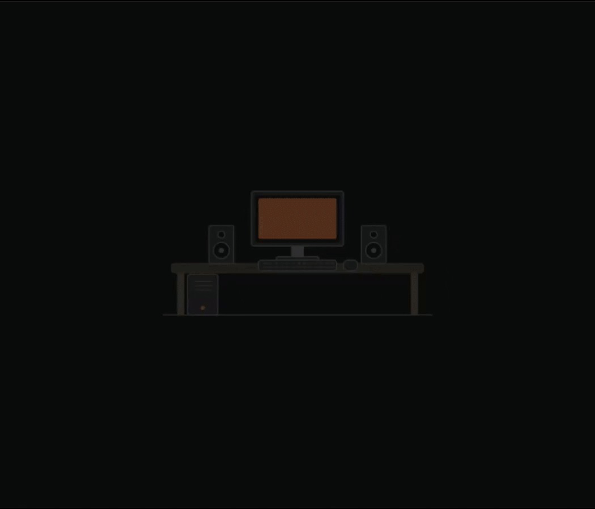

<div align="center">


# open-lux

**Automatic monitor brightness from a real light sensor.**

For DDC/CI displays (HDMI & DisplayPort), on Windows and Linux.

[](https://github.com/TathSikdar/open-lux/actions/workflows/ci.yml)
[](LICENSE)
[](https://github.com/TathSikdar/open-lux/releases)



[**Download**](https://github.com/TathSikdar/open-lux/releases) ·
[Build the sensor](#hardware) ·
[Print the case](hardware/README.md) ·
[How it works](#how-it-works)

</div>

---

An Arduino with an LDR reports the ambient light level ten times a second. Once
per monitor, the app sweeps the panel across its brightness and contrast range
with the sensor held against the screen, recording the luminance it actually
emits at each percent. In use, one response curve maps ambient lux to a target
luminance, and each display inverts its own measured table to hit that target.

Because the target is a luminance rather than a percentage, monitors with
different maximum brightness match each other. Displays that have not been
calibrated are never written to.

---

## Contents

- [Hardware](#hardware)
  - [Printed case](hardware/README.md)
- [Install](#install)
- [Using open-lux](#using-open-lux)
  - [1. First run](#1-first-run)
  - [2. Calibrating later](#2-calibrating-later)
  - [3. Everyday use](#3-everyday-use)
  - [4. ExtraDim](#4-extradim)
  - [5. Settings and the response curve](#5-settings-and-the-response-curve)
- [Troubleshooting](#troubleshooting)
- [How it works](#how-it-works)
- [Development](#development)
- [Limits](#limits)

---

## Hardware

| Part | Notes |
|---|---|
| Arduino Nano / Uno / ESP8266 / ESP32 | A Nano is sufficient |
| LDR | GL5506 (2k-5k). Higher values need a different resistor |
| Resistor | 5.1k. Higher resistances give finer resolution |

Wire the LDR and the resistor as a divider into an analog pin:


Flash `firmware/firmware.ino`, setting `SENSOR_PIN` to the pin the divider
feeds (`A7` by default). The sketch sends the raw sensor reading and nothing
else; all interpretation happens on the PC, so changing behaviour never
requires a reflash.

Loose components on the desk work. [**hardware/**](hardware/README.md) has a
printable case: a sensor head that holds the LDR flat against the screen for
calibration, and an enclosure for the board.

## Install

**Windows** — download `open-lux-x.y.z-windows-x64-setup.exe` from
[Releases](https://github.com/TathSikdar/open-lux/releases) and run it. It
installs per-user, so there is no administrator prompt, and it offers to start
open-lux at sign-in.

**Linux** — download `open-lux-x.y.z-linux-x86_64.AppImage`:

```sh
chmod +x open-lux-*-linux-x86_64.AppImage
./open-lux-*-linux-x86_64.AppImage
```

DDC/CI on Linux goes through `ddcutil`, so install it and make sure your user
can reach `/dev/i2c-*` (usually by joining the `i2c` group).

**From source** — needs Node 22+:

```sh
npm install
npm start
```

Neither packaged build requires Node.

---

## Using open-lux

### 1. First run

The first launch opens a setup wizard: it covers building the sensor, waits
until the Arduino is reporting, then calibrates each monitor it can see in
turn.


The wiring steps are skipped if the sensor is already reporting when the wizard
opens. **Skip this display** passes over a monitor you do not want controlled.
Reopen the wizard from **Settings ▸ Appearance ▸ Run first-time setup again**.

> **No display changes brightness until it has been calibrated.** A skipped or
> unfinished setup leaves those monitors alone.

If the sensor step never turns green, see
[Troubleshooting](#troubleshooting). `npm run fake` runs the interface from a
simulated sensor, without hardware.

### 2. Calibrating later

Calibration runs once per monitor and takes about a minute each. The wizard
does it the first time; afterwards it is at the bottom of Settings.

> **Calibrate in the dark.** The LDR cannot separate the screen's light from
> the room's, so any ambient light is recorded as if the panel had emitted it,
> corrupting the measured table and every decision made from it afterwards. A
> lit room is the most common cause of a bad calibration.


1. Open **Settings ▸ Calibrate** and pick the monitor. DDC names say nothing
   about physical position, so press **Identify display** — that panel blinks.
   Rename it under **Settings ▸ Displays**.
2. **Drag the open-lux window onto that monitor.** The square must be
   physically on the display being measured.
3. Set the contrast you normally use (50% is a reasonable default). Everything
   afterwards is measured relative to this value.
4. **Turn the lights off.**
5. Hold the LDR flat against the dashed square, covering it. Tape or Blu Tack
   helps; a shaking hand is measurement noise.
6. Press **Ready to calibrate**.

The square measures a black baseline, then steps through the panel's brightness
range one percent at a time, then its contrast range. Keep the room dark
throughout.

On completion it reports the range measured, for example
`Calibrated: 6.6 - 184 lux`. Repeat for each monitor.

**Recalibrate** after moving a monitor to different lighting, changing its OSD
picture mode, swapping the sensor hardware, or calibrating with the lights on.

### 3. Everyday use

Once a display is calibrated, open-lux tracks the room automatically. Home
shows the current ambient reading, the sensor's connection state, and where
each display is set.


**The slider is a correction.** A display moves immediately when you drag it
and stays there; automatic control resumes only when ambient light changes
significantly (about 20%), not when a cloud passes.

With **auto-learn** on, each adjustment also teaches the response curve what
you wanted at that light level. Corrections are local: what it learns at night
does not affect daylight settings.

Settings offers one slider for all displays or one per display.

### 4. ExtraDim

At 0% brightness most monitors are still too bright for a dark room. ExtraDim
continues past that point by lowering contrast.

The switch is on **Home**, under the sliders; the floor is **Settings ▸
ExtraDim ▸ Minimum contrast**. That card states, in the lux the panel was
measured in, where brightness alone bottoms out and how much lower the chosen
minimum reaches. On the response curve, the **purple stretch is where contrast
has taken over** from brightness; the flat section at the bottom is the floor
the minimum imposes, and the line below it is what the curve asked for but the
display cannot reach.

The contrast row on Home is always visible but only becomes draggable once
every display has reached 0% brightness, since above that contrast is not what
is dimming the screen.

Lowering contrast washes the picture out — that is the trade-off. Above the
brightness floor, contrast stays at the calibrated value.

### 5. Settings and the response curve


**Displays** — each monitor is listed under the name it reports (`DEL41A2` and
similar, which is all DDC provides). Type over it to rename; clearing the box
restores the hardware name.

**Appearance** — the theme follows the OS by default and switches with it; pick
Light or Dark to pin it. **Compact layout** tightens spacing. Every screen
scrolls, so the window works down to about 220px tall, and it reopens at
whatever size you leave it. The sidebar collapses from the button beside the
title.

**The curve** maps ambient light (horizontal, logarithmic) to target screen
brightness (vertical). Drag any point to reshape it and press **Save curve**.
The green marker shows the room's current level.


The axis stops at the dimmest calibrated panel's maximum: one curve drives
every display, so a higher target is unreachable for at least one of them.

**Auto-learn** — off, the curve changes only when you drag it. On, it follows
manual adjustments over time. With per-display sliders, it can learn from each
display separately (own scale factor, shared curve shape) or from both
averaged.

**Sensor** — the serial port is auto-detected; override it if several USB
serial devices are attached. The three constants below it — **fixed
resistor**, the **LDR's resistance at 10 lux**, and its **gamma** — convert raw
readings to lux. The defaults suit a GL5506 with a 5.1k resistor. Tick *LDR on
the VCC side of the divider* if brighter light lowers the reading. Absolute
accuracy is not required: calibration and the curve share the same units, so
any consistent scale works.

**Tray** — closing the window hides it to the tray; Quit from the tray menu
exits. The tray menu also has an **Automatic brightness** switch. *Start
minimised to the tray*, in the Sensor card, skips showing the window at
sign-in.

Settings live in `%APPDATA%\open-lux\config.json` (Windows) or
`~/.config/open-lux/config.json` (Linux). Deleting that file resets everything
and reruns the setup wizard.

---

## Troubleshooting

**"No serial ports found" / no lux reading**
Check the Arduino is connected and running `firmware/firmware.ino`, and that
`SENSOR_PIN` matches the wiring. With several USB serial devices attached,
select the port in Settings.

**The lux number never moves**
The LDR is probably not in the divider as expected. Open the Arduino serial
monitor at 9600 baud: a decimal number should appear ten times a second and
change when the sensor is covered. Pinned at 0.00 or 1023.00 means the divider
is miswired.

**Brighter light lowers the number**
The LDR is on the other leg of the divider. Tick *"LDR on the VCC side of the
divider"* in Settings.

**"No DDC/CI displays detected"**
- Many monitors ship with DDC/CI **disabled** in their on-screen menu. Look for
  DDC/CI, or sometimes "Auto Source"/service settings.
- Laptop internal panels have no DDC and are not supported.
- Some DisplayPort MST hubs and USB-C docks block DDC entirely.
- On Linux you need i2c access: `sudo usermod -aG i2c "$USER"`, then log out
  and back in. `sudo apt install ddcutil && ddcutil detect` confirms whether
  the monitor is reachable at all — if ddcutil cannot see it, open-lux cannot
  either.

**Calibration produced a flat or nonsensical curve**
Usually the room was not dark, the sensor was not flat against the screen, or
the light changed mid-sweep. The other common cause is the monitor's own
**dynamic contrast** — an "eco", "dynamic contrast" or "smart brightness" mode
that adjusts the backlight independently. Disable it in the monitor's menu and
calibrate again.

**Brightness flickers or hunts**
Lower `ema` in `config.json` (0.3 by default; smaller smooths more, 1.0 is no
smoothing). This does not belong in the firmware, which reports raw readings
only.

**No tray icon on Linux**
GNOME needs the AppIndicator extension. Without a tray host the window behaves
as a normal window and closing it exits.

**It changed the wrong monitor**
Displays are identified by model and position, so two identical monitors can
swap if replugged in a different order. Recalibrate, or swap the two entries in
`config.json`.

---

## How it works

```
Arduino --oversampled ADC, 10 Hz--> lux --> smoothing
                                              |
                             response curve: ambient lux -> target luminance
                                              |
                    +-------------------------+-------------------------+
            invert display A's        invert display B's        (uncalibrated)
             measured table            measured table                   |
                    |                         |                      skipped
              brightness 42%            brightness 67%
```

Smoothing is a single EMA on the lux reading, so the loop responds to the room
rather than to a cloud crossing the window. Everything after it is a table
lookup and a bisection: no PID, no panel model, nothing to tune once the sweep
has run.

## Development

```sh
npm install
npm test          # node:test -- no electron, no display, no hardware
npm run fake      # the app, driven by a simulated day/night cycle
npm run icon      # re-rasterise src/icon.svg after editing it
npm start
```

DDC/CI needs a native binding with no prebuilt binaries, so on **Windows**
`npm install` requires the *Desktop development with C++* workload from
[Visual Studio Build Tools](https://visualstudio.microsoft.com/downloads/).
Without it `@hensm/ddcci` is skipped and the app reports *No DDC/CI displays
detected*. It is N-API based, so no `electron-rebuild` is needed. On **Linux**
there is nothing to compile: install `ddcutil` and ensure access to
`/dev/i2c-*`.

```
open-lux/
├── firmware/
│   └── firmware.ino    Arduino sketch (the name must match its folder -
│                       an Arduino IDE requirement)
├── src/
│   ├── core.js         lux maths, curve, calibration tables, learning
│   ├── controller.js   the control loop: reading in, brightness/contrast out
│   ├── hardware.js     serial reader, DDC writer, calibration sweep
│   ├── main.js         electron main: window, tray, config file, IPC
│   ├── preload.cjs     the contextBridge surface
│   ├── graph.js        the drag-editable curve, on canvas
│   ├── renderer.js     renderer shell: routing, and the two IPC messages
│   ├── ui.js           bridge, DOM helpers and the shared curve
│   ├── calibration.js  one sweep's IPC handlers, shared by the two callers
│   ├── setup.js        the first-run wizard, a takeover rather than a page
│   ├── pages/          one module per screen - home, settings, and calibrate,
│   │                   which is a section of settings - each build/enter/tick
│   ├── index.html      markup, incl. the Home-screen desk illustration and
│   │                   the wizard, both as SVG/markup rather than assets
│   ├── icon.svg        the app icon; icon.png/.ico are rasterised from it
│   └── style.css       the palette, as custom properties
├── tools/
│   └── icon.cjs        icon.svg -> icon.png + icon.ico   (npm run icon)
├── test/
└── docs/
```

There are two screens, Home and Settings. Calibrate and ExtraDim are sections
of Settings rather than pages: one is used once per monitor, the other is a
switch and a slider.

`core.js` and `controller.js` import nothing — not electron, not node — so the
maths and the control loop can be tested under bare `node --test`, and the main
process and renderer can load the same file. `test/calibration.test.js` runs
the real three-minute sweep against a simulated panel in about two seconds.

The palette lives only in `style.css`: `graph.js` reads the same custom
properties via `getComputedStyle`, and Electron's `nativeTheme.themeSource`
drives `prefers-color-scheme`, so *Follow system* needs no code.

**Building the packaged app:**

```sh
npx electron-builder        # -> dist/  (NSIS installer, or an AppImage)
```

Tagging a commit `v*` builds both and attaches them to a GitHub Release. The
tag must match `version` in `package.json` or the workflow stops, since
electron-builder takes the version from there.

## Limits

- **DDC/CI external displays only.** Laptop internal panels have no DDC and no
  contrast control.
- **Displays are identified by model and position**, because DDC does not
  reliably expose serial numbers.
- **The lux figures are approximate.** They come from the LDR's power law with
  tunable constants; the absolute scale does not matter, because calibration
  and the curve use the same units.

## Licence

GPL-3.0-or-later. See [LICENSE](LICENSE).
