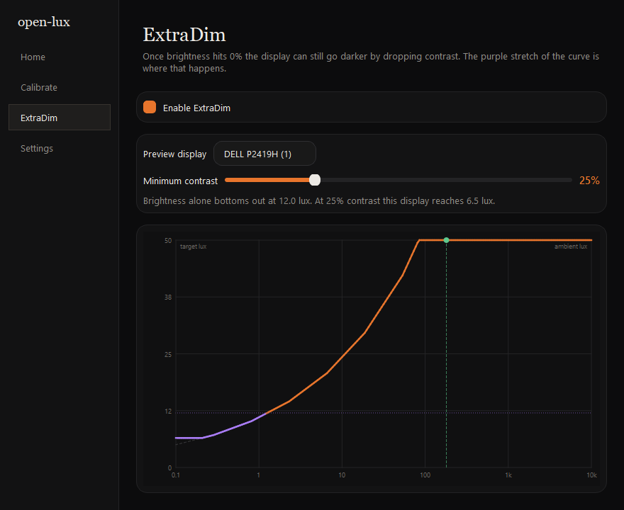

# open-lux

[](https://github.com/TathSikdar/open-lux/actions/workflows/ci.yml)
[](LICENSE)

Automatic monitor brightness driven by a real light sensor, for DDC/CI displays
(HDMI & DisplayPort) on **Windows and Linux**.

An Arduino reports the ambient light level once a second. The app **measures**
what each of your displays actually emits, then drives every calibrated display
to match the room. Displays you have not calibrated are never touched.


---

## Contents

- [Hardware](#hardware)
- [Install](#install)
- [Using open-lux](#using-open-lux)
  - [1. First run](#1-first-run)
  - [2. Calibrate each display](#2-calibrate-each-display)
  - [3. Everyday use](#3-everyday-use)
  - [4. ExtraDim](#4-extradim)
  - [5. Settings and the response curve](#5-settings-and-the-response-curve)
- [Troubleshooting](#troubleshooting)
- [How it works](#how-it-works)
- [Development](#development)
- [Limits](#limits)

---

## Hardware

| Part | Notes |
|---|---|
| Arduino Nano / Uno / ESP8266 / ESP32 | A Nano is plenty; anything bigger is just more to hide |
| LDR | GL5506 (2k-5k). Higher values are overkill unless you drop the resistor |
| Resistor | 5.1k. Higher resistances give finer resolution |

Wire the LDR and the resistor as a divider into an analog pin:


Then flash `firmware/firmware.ino`, setting `SENSOR_PIN` to the pin your
divider feeds (`A7` by default). It sends nothing but the raw sensor reading —
all the interpretation happens on the PC, so you never reflash to change
behaviour.

## Install

**Windows** — download `open-lux-x.y.z-windows-x64-setup.exe` from
[Releases](https://github.com/TathSikdar/open-lux/releases) and run it. It
installs per-user, so there is no administrator prompt, and it offers to start
open-lux when you sign in.

**Linux** — download and extract `open-lux-linux-x86_64.tar.gz`, then:

```sh
cd openlux
./install-linux.sh
```

Installs to `~/.local/opt/openlux` with a menu entry, touches nothing outside
your home directory, and offers autostart. `./install-linux.sh --uninstall`
reverses it.

**From source** — needs Python 3.9+:

```sh
pip install .
openlux
```

Neither packaged build needs Python installed.

---

## Using open-lux

### 1. First run

Open open-lux. The Home screen should show a live figure in lux and
`Connected to COM3` (or `/dev/ttyUSB0`) underneath it. Cover the LDR with your
hand — the number should drop within a second or two.

If it says something else, jump to [Troubleshooting](#troubleshooting).

> **Nothing will change brightness yet.** open-lux only drives displays it has
> measured, so until you calibrate one it just sits there reporting light
> levels. That is deliberate, not a fault.

To explore the interface before building the hardware, run `openlux --fake` —
it drives everything from a simulated sensor.

### 2. Calibrate each display

This is the one step that matters, and you do it once per monitor. It takes
about three minutes each.


1. Go to **Calibrate** and pick the monitor from the dropdown.
2. **Drag the open-lux window onto that monitor.** The white square has to be
   physically on the display you are measuring.
3. Set the contrast you normally use (50% is a sensible default). Everything
   the app does later is measured relative to this value.
4. Hold the LDR flat against the white square, covering it, so it sees the
   screen and as little of the room as possible. Tape or a bit of Blu Tack
   helps — your hand shaking is measurement noise.
5. Press **Ready to calibrate** and leave it alone.

The screen goes black briefly to measure a baseline, then white, then cycles
through its whole brightness range one percent at a time, then through its
contrast range. Keep the room's lighting steady throughout — turning a lamp on
halfway through will bend the results.

When it finishes you will see the range it measured, something like
`Calibrated: 12.4 - 318 lux`. Repeat for every monitor you want controlled.

**Recalibrate if** you move a monitor somewhere with different lighting, change
its OSD picture mode, or swap the sensor hardware.

### 3. Everyday use

Once at least one display is calibrated, open-lux tracks the room by itself.
Home shows the current ambient reading and where each display has been set.


**The slider is a correction, not a fight.** Drag it and that display moves
immediately, and stays where you put it — automatic control does not snap it
back. It resumes only when the room's light genuinely changes (about a 20%
shift), not when a cloud passes.

With **auto-learn** on, every adjustment also teaches the response curve what
you wanted at that light level. Nudge it dimmer a few evenings in a row and it
will start getting evenings right on its own. Corrections are local: what you
teach it at night does not disturb your daylight settings.

In Settings you can choose one slider for everything or one per display.

### 4. ExtraDim

At 0% brightness most monitors are still too bright for a dark room. ExtraDim
keeps going by lowering contrast.



Turn it on, then set the lowest contrast you find acceptable. The graph
redraws as you drag: the **purple stretch is where contrast has taken over**
from brightness, and the flat part at the bottom is the floor your minimum
imposes. The line below it shows what the curve was asking for but the display
cannot reach.

Lowering contrast does wash the picture out — that is the trade, and the
minimum is yours to set. Above the brightness floor, contrast is left alone at
whatever you calibrated with.

### 5. Settings and the response curve


**The curve** maps ambient light (horizontal, logarithmic — how our eyes work)
to how bright you want the screen (vertical). Drag any point to reshape it and
press **Save curve**. The green marker shows where the room is right now, so
you can see which part of the curve you are actually sitting on.

**Appearance** — the theme follows Windows or your desktop by default and
switches the moment the system does; pick Light or Dark to pin it. **Compact
layout** tightens the spacing for a short window. Every screen scrolls, so the
window can be dragged down to about 220px tall, and whatever size you leave it
at is the size it opens at next time.

**Auto-learn** — off means the curve only changes when you drag it. On, it
follows your manual adjustments over time. With one knob per display you can
also choose whether it learns from each display separately (each gets its own
scale factor, curve shape shared) or from both averaged.

**Sensor** — the serial port is auto-detected; override it if you have several
USB serial devices. The LDR constants convert raw readings into lux. The
defaults suit a GL5506 with a 5.1k resistor; adjust them if your lux figures
look implausible, or flip the divider checkbox if brighter light makes the
number go *down*. The absolute values do not have to be right — calibration
and the curve share the same units, so any consistent scale works.

**Tray** — closing the window hides it to the tray; Quit from the tray menu
really exits. The tray menu also has an **Automatic brightness** switch for
when you want it to stop adjusting without quitting.

Settings live in `%APPDATA%\open-lux\config.json` (Windows) or
`~/.config/open-lux/config.json` (Linux). Delete that file to start over.

---

## Troubleshooting

**"No serial ports found" / no lux reading**
Check the Arduino is plugged in and that you flashed `firmware/firmware.ino`,
not the old sketch. Confirm `SENSOR_PIN` matches your wiring. If several USB
serial devices are attached, pick the right port in Settings.

**The lux number never moves**
The LDR is probably not in the divider you think it is. Open the Arduino
serial monitor at 9600 baud — you should see a number about once a second that
changes when you cover the sensor. If it is pinned at 0 or 1023, the divider is
miswired.

**Brighter light makes the number go down**
Your LDR is on the other leg of the divider. Flip *"LDR on the VCC side of the
divider"* in Settings.

**"No DDC/CI displays detected"**
- Many monitors ship with DDC/CI **disabled** in their on-screen menu. Look for
  DDC/CI, or sometimes "Auto Source"/service settings, and turn it on.
- Laptop internal panels have no DDC and are not supported.
- Some DisplayPort MST hubs and USB-C docks block DDC entirely.
- On Linux you need i2c access: `sudo usermod -aG i2c "$USER"`, then log out
  and back in. `sudo apt install ddcutil && ddcutil detect` is a good way to
  confirm the monitor is reachable at all — if ddcutil cannot see it, open-lux
  cannot either.

**Calibration produced a flat or nonsensical curve**
Usually the sensor was not flat against the screen, or the room's light changed
mid-sweep. The other big cause is the **monitor's own dynamic contrast** — many
panels have an "eco", "dynamic contrast" or "smart brightness" mode that
adjusts the backlight on its own. That fights the measurement and then fights
open-lux. Turn it off in the monitor's menu and calibrate again.

**Brightness flickers or hunts**
Raise `CHANGE_THRESHOLD` in the sketch so it reports smaller changes less
eagerly, or lower `ema` in `config.json` (0.3 by default; smaller smooths more).

**No tray icon on Linux**
GNOME needs the AppIndicator extension. Without a tray host the window just
stays a normal window — nothing is lost, closing it exits.

**It changed the wrong monitor**
Displays are matched by model and position. Two identical monitors can swap if
you replug them in a different order. Recalibrate, or swap the two entries in
`config.json`.

---

## How it works

```
Arduino --raw ADC, 1 Hz on change--> lux --> smoothing
                                              |
                             response curve: ambient lux -> target luminance
                                              |
                    +-------------------------+-------------------------+
            invert display A's        invert display B's        (uncalibrated)
             measured table            measured table                   |
                    |                         |                      skipped
              brightness 42%            brightness 67%
```

Calibration records what each display emits at every brightness percentage.
One shared curve turns the room's light into a target luminance, and each
display inverts **its own measured table** to hit it. That is why two monitors
with different maximum brightness get different percentages and still end up
looking the same — and why an uncalibrated display is left alone rather than
guessed at.

## Development

```sh
pip install -e ".[dev]"
pytest
```

`tests/test_core.py` covers the lux maths, the curve, table inversion and
learning. `tests/test_calibration.py` drives the real sweep and the real window
against a simulated panel, so the three-minute calibration and the DDC writes
are exercised without hardware. On a headless machine set
`QT_QPA_PLATFORM=offscreen`.

```
open-lux/
├── firmware/
│   └── firmware.ino            Arduino sketch (the name has to match its
│                               folder - that is the IDE's rule, not ours)
├── openlux/
│   ├── core.py                 lux maths, curve, calibration tables, learning
│   ├── hardware.py             serial reader, DDC writer, calibration sweep
│   ├── curve.py                the drag-editable graph widget
│   ├── desk.py                 the painted Home-screen illustration
│   ├── ui.py                   window, tray, the four screens
│   ├── theme.py                light/dark and roomy/compact palettes
│   └── style.qss               the stylesheet theme.py fills in
├── packaging/                  PyInstaller spec, installers, icon/screenshot tools
├── tests/
└── docs/
```

`core.py` imports no Qt, which is what lets the maths be tested on its own.

**Building the packaged app:**

```sh
pip install pyinstaller
pyinstaller --noconfirm packaging/openlux.spec   # -> dist/openlux/
iscc packaging/openlux.iss                       # Windows installer (Inno Setup)
```

Tagging a commit `v*` builds both and attaches them to a GitHub Release.
`packaging/make_icons.py` and `packaging/make_screenshots.py` regenerate the
icon and the images in this README.

## Limits

- **DDC/CI external displays only.** Laptop internal panels have no DDC and no
  contrast control, so ExtraDim could not work on them anyway.
- **Displays are identified by model and position**, because DDC does not
  reliably expose serial numbers.
- **The lux figures are approximate.** They come from the LDR's power law with
  tunable constants; the absolute scale never has to be right, because
  calibration and the curve are measured in the same units.

## History

This started as a 43-line project: the Arduino applied a quadratic curve fitted
by hand to one Dell P2419H, and a Python script scanned COM0-COM49 and pushed
the result at every display at once. The old formula is still in the git
history if you want it.

## Licence

GPL-3.0-or-later. See [LICENSE](LICENSE).
