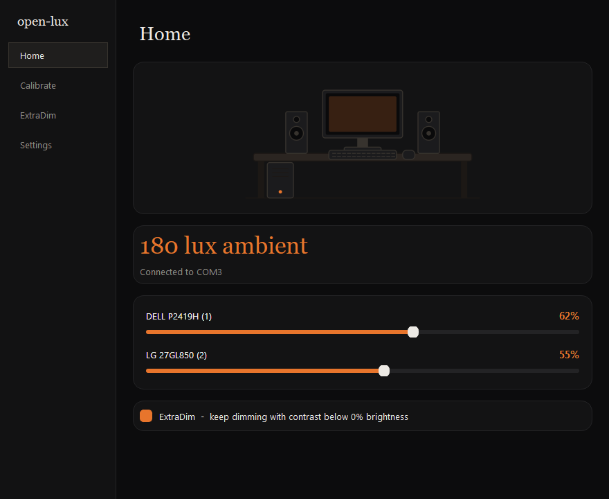
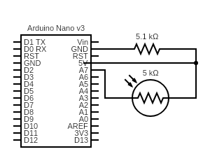
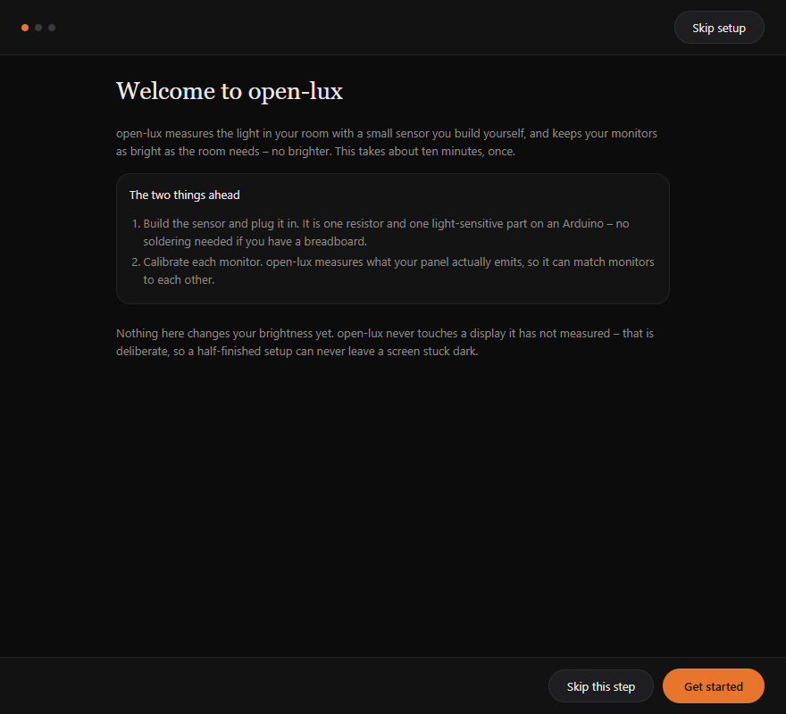
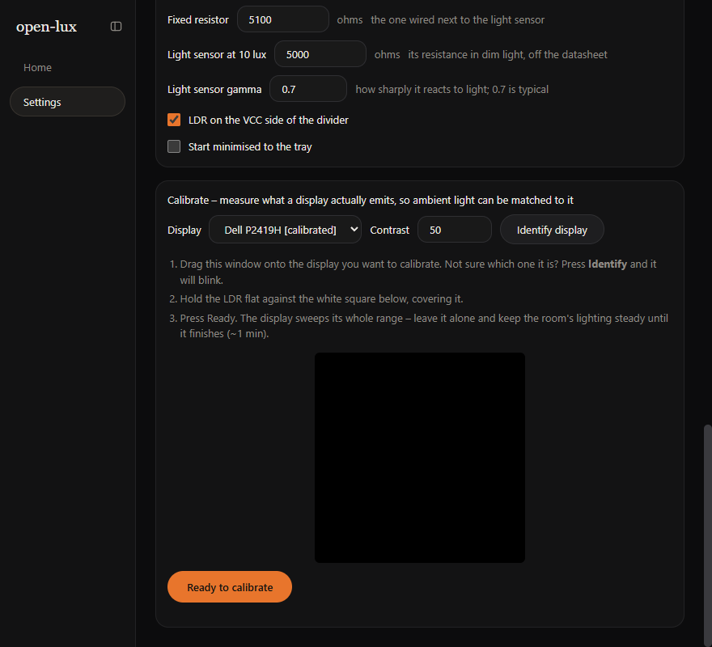
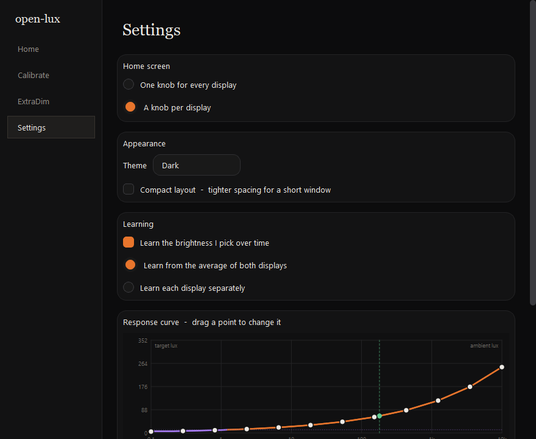
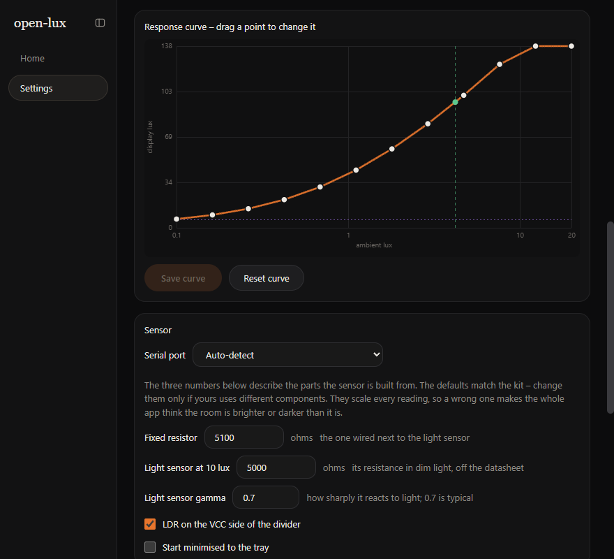

# open-lux

[](https://github.com/TathSikdar/open-lux/actions/workflows/ci.yml)
[](LICENSE)

Automatic monitor brightness driven by a real light sensor, for DDC/CI displays
(HDMI & DisplayPort) on **Windows and Linux**.

An Arduino reports the ambient light level ten times a second, oversampled so
the reading carries decimals rather than whole ADC counts. The app **measures**
what each of your displays actually emits, then drives every calibrated display
to match the room. Displays you have not calibrated are never touched.



---

## Contents

- [Hardware](#hardware)
- [Install](#install)
- [Using open-lux](#using-open-lux)
  - [1. First run](#1-first-run)
  - [2. Calibrating later](#2-calibrating-later)
  - [3. Everyday use](#3-everyday-use)
  - [4. ExtraDim](#4-extradim)
  - [5. Settings and the response curve](#5-settings-and-the-response-curve)
- [Troubleshooting](#troubleshooting)
- [How it works](#how-it-works)
- [Development](#development)
- [Limits](#limits)

---

## Hardware

| Part | Notes |
|---|---|
| Arduino Nano / Uno / ESP8266 / ESP32 | A Nano is plenty; anything bigger is just more to hide |
| LDR | GL5506 (2k-5k). Higher values are overkill unless you drop the resistor |
| Resistor | 5.1k. Higher resistances give finer resolution |

Wire the LDR and the resistor as a divider into an analog pin:



Then flash `firmware/firmware.ino`, setting `SENSOR_PIN` to the pin your
divider feeds (`A7` by default). It sends nothing but the raw sensor reading —
all the interpretation happens on the PC, so you never reflash to change
behaviour.

## Install

**Windows** — download `open-lux-x.y.z-windows-x64-setup.exe` from
[Releases](https://github.com/TathSikdar/open-lux/releases) and run it. It
installs per-user, so there is no administrator prompt, and it offers to start
open-lux when you sign in.

**Linux** — download `open-lux-x.y.z.AppImage`, make it executable and run it:

```sh
chmod +x open-lux-*.AppImage
./open-lux-*.AppImage
```

DDC/CI on Linux goes through `ddcutil`, so install it and make sure your user
can reach `/dev/i2c-*` (usually by joining the `i2c` group).

**From source** — needs Node 22+:

```sh
npm install
npm start
```

Neither packaged build needs Node installed.

---

## Using open-lux

### 1. First run

The first launch opens a setup wizard, and it is the whole of the getting
started guide: it walks through building the sensor, waits until the Arduino is
actually reporting, then calibrates each monitor it can see, one after another.



The wizard skips the wiring instructions if the sensor is already talking when
it opens, and **Skip this display** moves past a monitor you do not want
controlled. You can reopen it any time from **Settings ▸ Appearance ▸ Run
first-time setup again**.

> **Nothing will change brightness until a display has been measured.**
> open-lux only drives displays it has calibrated, so a skipped or half-finished
> setup leaves them alone rather than guessing. That is deliberate, not a fault.

If the sensor step never goes green, jump to
[Troubleshooting](#troubleshooting). To explore the interface before building
the hardware, run `npm run fake` — it drives everything from a simulated sensor.

### 2. Calibrating later

Calibration is the one step that matters, and you do it once per monitor. It
takes about a minute each. The wizard runs it for you the first time; after that
it lives at the bottom of Settings, for a monitor you skipped or one you have
moved.

> **Calibrate in the dark.** Turn the room lights off and close the blinds
> first. The LDR cannot tell the screen's light from the room's, so anything
> the room contributes is baked into the display's measured table as if the
> panel had emitted it — and every brightness decision afterwards is made from
> that table. A lit room is the most common cause of a bad calibration.



1. Go to **Settings ▸ Calibrate**, at the bottom of the page, and pick the
   monitor from the dropdown. The names come from DDC and say nothing about
   where a monitor sits on your desk, so press **Identify display** — that panel
   blinks a few times, then goes back to normal. Rename it to whatever you call
   it under **Settings ▸ Displays**.
2. **Drag the open-lux window onto that monitor.** The square has to be
   physically on the display you are measuring.
3. Set the contrast you normally use (50% is a sensible default). Everything
   the app does later is measured relative to this value.
4. **Turn the lights off.** The dashed square is where the sensor goes; it
   only fills with black and white once the sweep starts.
5. Hold the LDR flat against the square, covering it, so it sees the screen and
   as little of the room as possible. Tape or a bit of Blu Tack helps — your
   hand shaking is measurement noise.
6. Press **Ready to calibrate** and leave it alone.

The square goes black briefly to measure a baseline, then turns white and
cycles through the panel's whole brightness range one percent at a time, then
through its contrast range. Keep the room dark throughout — turning a lamp on
halfway through will bend the results.

When it finishes you will see the range it measured, something like
`Calibrated: 6.6 - 184 lux`. Repeat for every monitor you want controlled.

**Recalibrate if** you move a monitor somewhere with different lighting, change
its OSD picture mode, swap the sensor hardware — or if you calibrated with the
lights on.

### 3. Everyday use

Once at least one display is calibrated, open-lux tracks the room by itself.
Home shows the current ambient reading, whether the sensor is actually talking,
and where each display has been set.


**The slider is a correction, not a fight.** Drag it and that display moves
immediately, and stays where you put it — automatic control does not snap it
back. It resumes only when the room's light genuinely changes (about a 20%
shift), not when a cloud passes.

With **auto-learn** on, every adjustment also teaches the response curve what
you wanted at that light level. Nudge it dimmer a few evenings in a row and it
will start getting evenings right on its own. Corrections are local: what you
teach it at night does not disturb your daylight settings.

In Settings you can choose one slider for everything or one per display.

### 4. ExtraDim

At 0% brightness most monitors are still too bright for a dark room. ExtraDim
keeps going by lowering contrast.

The switch is on **Home**, under the sliders; how far down it may go is
**Settings ▸ ExtraDim ▸ Minimum contrast**. That card spells out what the
setting buys, in the lux the panel was measured in — where brightness alone
bottoms out, and how much lower the minimum you have picked reaches. The
response curve redraws with it too: the **purple
stretch is where contrast has taken over** from brightness, and the flat part at
the bottom is the floor your minimum imposes. The line below it shows what the
curve was asking for but the display cannot reach.

The contrast row on Home is always visible, because contrast is half of what is
being driven — but it only becomes draggable once every display has bottomed out
at 0% brightness, since above that contrast is not what is dimming the screen.

Lowering contrast does wash the picture out — that is the trade, and the
minimum is yours to set. Above the brightness floor, contrast is left alone at
whatever you calibrated with.

### 5. Settings and the response curve



**Displays** — each monitor is listed under the name it reports for itself
(`DEL41A2` and the like, which is all DDC gives). Type over it to call it
something you recognise; clearing the box puts the hardware name back.

**Appearance** — the theme follows Windows or your desktop by default and
switches the moment the system does; pick Light or Dark to pin it. **Compact
layout** tightens the spacing for a short window. Every screen scrolls, so the
window can be dragged down to about 220px tall, and whatever size you leave it
at is the size it opens at next time. The sidebar folds away too, from the
button beside the title.

**The curve** maps ambient light (horizontal, logarithmic — how our eyes work)
to how bright you want the screen (vertical). Drag any point to reshape it and
press **Save curve**. The green marker shows where the room is right now, so
you can see which part of the curve you are actually sitting on.



The axis stops at the *dimmest* calibrated panel's maximum: one curve drives
every display, so a target above that is one they cannot all reach anyway.

**Auto-learn** — off means the curve only changes when you drag it. On, it
follows your manual adjustments over time. With one knob per display you can
also choose whether it learns from each display separately (each gets its own
scale factor, curve shape shared) or from both averaged.

**Sensor** — the serial port is auto-detected; override it if you have several
USB serial devices. The three numbers below it describe the parts your sensor is
built from — **fixed resistor**, the **LDR's resistance at 10 lux** and its
**gamma** — and together they convert raw readings into lux. The defaults suit
a GL5506 with a 5.1k resistor; adjust them if your lux figures look
implausible, or tick *LDR on the VCC side of the divider* if brighter light
makes the number go *down*. The absolute values do not have to be right —
calibration and the curve share the same units, so any consistent scale works.

**Tray** — closing the window hides it to the tray; Quit from the tray menu
really exits. The tray menu also has an **Automatic brightness** switch for
when you want it to stop adjusting without quitting. *Start minimised to the
tray*, in the Sensor card, skips showing the window at sign-in.

Settings live in `%APPDATA%\open-lux\config.json` (Windows) or
`~/.config/open-lux/config.json` (Linux). Delete that file to start over — the
setup wizard runs again on the next launch.

---

## Troubleshooting

**"No serial ports found" / no lux reading**
Check the Arduino is plugged in and that you flashed `firmware/firmware.ino`,
not the old sketch. Confirm `SENSOR_PIN` matches your wiring. If several USB
serial devices are attached, pick the right port in Settings.

**The lux number never moves**
The LDR is probably not in the divider you think it is. Open the Arduino
serial monitor at 9600 baud — you should see a decimal number ten times a
second that changes when you cover the sensor. If it is pinned at 0.00 or
1023.00, the divider is miswired.

**Brighter light makes the number go down**
Your LDR is on the other leg of the divider. Flip *"LDR on the VCC side of the
divider"* in Settings.

**"No DDC/CI displays detected"**
- Many monitors ship with DDC/CI **disabled** in their on-screen menu. Look for
  DDC/CI, or sometimes "Auto Source"/service settings, and turn it on.
- Laptop internal panels have no DDC and are not supported.
- Some DisplayPort MST hubs and USB-C docks block DDC entirely.
- On Linux you need i2c access: `sudo usermod -aG i2c "$USER"`, then log out
  and back in. `sudo apt install ddcutil && ddcutil detect` is a good way to
  confirm the monitor is reachable at all — if ddcutil cannot see it, open-lux
  cannot either.

**Calibration produced a flat or nonsensical curve**
Usually the room was not dark, the sensor was not flat against the screen, or
the light changed mid-sweep — redo it with the lights off. The other big cause
is the **monitor's own dynamic contrast** — many
panels have an "eco", "dynamic contrast" or "smart brightness" mode that
adjusts the backlight on its own. That fights the measurement and then fights
open-lux. Turn it off in the monitor's menu and calibrate again.

**Brightness flickers or hunts**
Lower `ema` in `config.json` (0.3 by default; smaller smooths more, 1.0 is no
smoothing at all). The firmware is not the place to fix this — it reports raw
readings and nothing else.

**No tray icon on Linux**
GNOME needs the AppIndicator extension. Without a tray host the window just
stays a normal window — nothing is lost, closing it exits.

**It changed the wrong monitor**
Displays are matched by model and position. Two identical monitors can swap if
you replug them in a different order. Recalibrate, or swap the two entries in
`config.json`.

---

## How it works

```
Arduino --oversampled ADC, 10 Hz--> lux --> smoothing
                                              |
                             response curve: ambient lux -> target luminance
                                              |
                    +-------------------------+-------------------------+
            invert display A's        invert display B's        (uncalibrated)
             measured table            measured table                   |
                    |                         |                      skipped
              brightness 42%            brightness 67%
```

Calibration records what each display emits at every brightness percentage.
One shared curve turns the room's light into a target luminance, and each
display inverts **its own measured table** to hit it. That is why two monitors
with different maximum brightness get different percentages and still end up
looking the same — and why an uncalibrated display is left alone rather than
guessed at.

## Development

```sh
npm install
npm test          # node:test -- no electron, no display, no hardware
npm run fake      # the app, driven by a simulated day/night cycle
npm run icon      # re-rasterise src/icon.svg after editing it
npm start
```

DDC/CI needs a native binding that has no prebuilt binaries, so on **Windows**
`npm install` needs the *Desktop development with C++* workload from
[Visual Studio Build Tools](https://visualstudio.microsoft.com/downloads/) —
without it `@hensm/ddcci` is skipped and the app reports *No DDC/CI displays
detected*. It is N-API based, so it needs no `electron-rebuild`. On **Linux**
there is nothing to compile: install `ddcutil` and make sure your user can
reach `/dev/i2c-*`.

```
open-lux/
├── firmware/
│   └── firmware.ino    Arduino sketch (the name has to match its folder -
│                       that is the IDE's rule, not ours)
├── src/
│   ├── core.js         lux maths, curve, calibration tables, learning
│   ├── controller.js   the control loop: reading in, brightness/contrast out
│   ├── hardware.js     serial reader, DDC writer, calibration sweep
│   ├── main.js         electron main: window, tray, config file, IPC
│   ├── preload.cjs     the contextBridge surface
│   ├── graph.js        the drag-editable curve, on canvas
│   ├── renderer.js     renderer shell: routing, and the two IPC messages
│   ├── ui.js           bridge, DOM helpers and the shared curve
│   ├── calibration.js  one sweep's IPC handlers, shared by the two callers
│   ├── setup.js        the first-run wizard, a takeover rather than a page
│   ├── pages/          one module per screen - home, settings, and calibrate,
│   │                   which is a section of settings - each build/enter/tick
│   ├── index.html      markup, incl. the Home-screen desk illustration and
│   │                   the wizard, both as SVG/markup rather than assets
│   ├── icon.svg        the app icon; icon.png/.ico are rasterised from it
│   └── style.css       the palette, as custom properties
├── tools/
│   └── icon.cjs        icon.svg -> icon.png + icon.ico   (npm run icon)
├── test/
└── docs/
```

The window has two screens, Home and Settings. Calibrate and ExtraDim are
sections of Settings rather than pages of their own: one is used once per
monitor, the other is a switch and a slider, and a sidebar entry each made them
look like somewhere you were meant to keep going back to.

`core.js` and `controller.js` import nothing at all — not electron, not node —
which is what lets the maths *and* the control loop be tested under bare
`node --test`, and lets the main process and the renderer load the same file.
`test/calibration.test.js` drives the real three-minute sweep against a
simulated panel in about two seconds.

The palette lives only in `style.css`: `graph.js` reads the same custom
properties with `getComputedStyle`, and Electron's `nativeTheme.themeSource`
drives `prefers-color-scheme`, so *Follow system* needs no code.

**Building the packaged app:**

```sh
npx electron-builder        # -> dist/  (NSIS installer, or an AppImage)
```

Tagging a commit `v*` builds both and attaches them to a GitHub Release. The
tag has to match `version` in `package.json` or the workflow stops, since
electron-builder takes the version from there and would otherwise ship a
mislabelled installer.

## Limits

- **DDC/CI external displays only.** Laptop internal panels have no DDC and no
  contrast control, so ExtraDim could not work on them anyway.
- **Displays are identified by model and position**, because DDC does not
  reliably expose serial numbers.
- **The lux figures are approximate.** They come from the LDR's power law with
  tunable constants; the absolute scale never has to be right, because
  calibration and the curve are measured in the same units.

## History

This started as a 43-line project: the Arduino applied a quadratic curve fitted
by hand to one Dell P2419H, and a Python script scanned COM0-COM49 and pushed
the result at every display at once. The old formula is still in the git
history if you want it.

## Licence

GPL-3.0-or-later. See [LICENSE](LICENSE).
